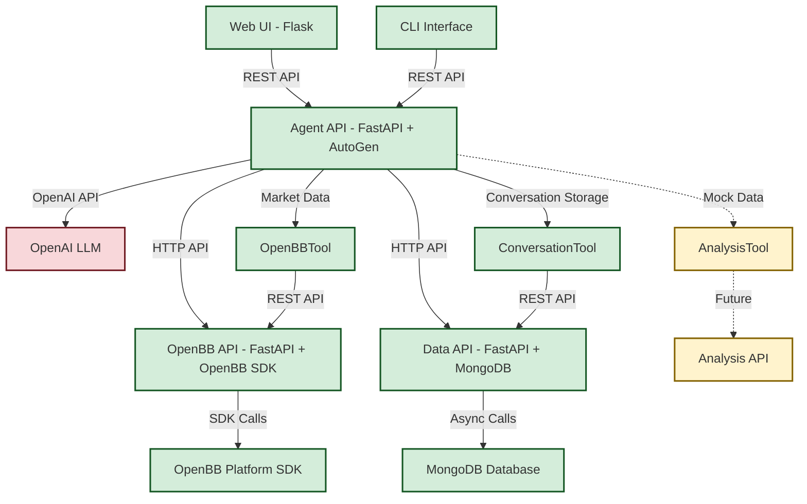

# InvestR High-Level Architecture


## Overview
A modular, containerised Docker Compose architecture comprising Python-based
microservices, each serving distinct responsibilities.


## Architecture Layout
```text
InvestR Compose (Docker Compose) - Current Implementation
│
├── Web UI (Flask) ✓ IMPLEMENTED
│   ├── Chat interface with markdown rendering
│   ├── Tool call disclosure widgets
│   └── Communicates with Agent API via REST
│
├── Agent API (FastAPI + AutoGen + OpenAI) ✓ IMPLEMENTED
│   ├── Interacts with OpenAI LLM (gpt-4o-mini)
│   ├── Executes agentic workflows using AutoGen framework
│   ├── Automatic conversation storage with session management
│   ├── Contains HTTP client tools:
│   │   ├── ConversationTool - conversation storage and session management ✓
│   │   ├── OpenBBTool - market data retrieval via OpenBB API ✓
│   │   └── AnalysisTool - financial analysis (mock data)
│   └── Streaming and standard response endpoints
│
├── CLI Interface ✓ IMPLEMENTED
│   └── Command-line client for agent interaction
│
├── OpenBB API (FastAPI + OpenBB Platform SDK) ✓ IMPLEMENTED
│   ├── Real-time market data via OpenBB Platform
│   ├── Historical price data and financial metrics
│   ├── RESTful endpoints with proper error handling
│   └── Graceful fallback to mock data when SDK unavailable
│
├── Data API (FastAPI + MongoDB) ✓ IMPLEMENTED
│   ├── Conversation storage with MongoDB persistence
│   ├── Session-based conversation organization
│   └── RESTful endpoints for conversation management
│
└── Future Services:
    └── Analysis API (FastAPI) - PLANNED
```


## Services

### Web UI (Flask) ✓ IMPLEMENTED
- **Chat Interface**: Interactive investment research chat with markdown rendering
- **Tool Call Visualization**: Disclosure widgets showing agent tool executions
- **Session Management**: User session tracking and conversation history
- **Responsive Design**: Modern, mobile-friendly interface
- **Error Handling**: Graceful error display and user feedback

### Agent API (FastAPI + AutoGen + OpenAI) ✓ IMPLEMENTED
- **AutoGen Integration**: Built on Microsoft's AutoGen framework
- **OpenAI LLM**: Uses gpt-4o-mini for natural language processing
- **Tool Orchestration**: Integrated tools for investment research workflow
- **Streaming Responses**: Real-time response streaming capabilities
- **REST Endpoints**: `/agent/stream`, `/health`
- **Type Safety**: Full Pydantic model validation

### CLI Interface ✓ IMPLEMENTED
- **Command-line Access**: Direct agent interaction without web UI
- **Session Management**: Persistent session handling
- **Development Tool**: Useful for testing and automation

### OpenBB API (FastAPI + OpenBB Platform SDK) ✓ IMPLEMENTED
- **Real Market Data**: Integration with OpenBB Platform SDK v4.4.5
- **REST Endpoints**: `/health`, `/market-data/historical/{symbol}`, `/market-data/quote/{symbol}`, `/market-data/batch`
- **LLM-Driven Parameters**: Automatically extracts symbol, period, interval from natural language
- **Error Handling**: Graceful fallback to mock data when SDK unavailable
- **Lazy Loading**: OpenBB SDK imported only when needed for container resilience
- **Type Safety**: Pydantic models with Literal types for provider validation
- **Multi-Provider Support**: yfinance, fmp, intrinio, polygon, tiingo providers

### Agent Tools (HTTP Client Implementation)
These tools are implemented within the Agent API and make HTTP calls to microservices:

#### ConversationTool - `store_conversation` ✅ IMPLEMENTED
- **Purpose**: Conversation storage and session management
- **Status**: Real MongoDB integration for persistent storage
- **Features**: Store/retrieve conversations, session tracking, message history
- **Integration**: Direct HTTP client with Data API (http://data-api:8002)
- **Fallback**: Mock storage when Data API unavailable

#### OpenBBTool - `get_market_data` ✓ IMPLEMENTED
- **Purpose**: Real-time and historical market data retrieval
- **Status**: HTTP client calling OpenBB API service with real market data
- **Integration**: Fully functional with OpenBB Platform SDK via microservice
- **Features**: LLM parameter extraction, provider selection, error handling

#### AnalysisTool - `analyze_data`
- **Purpose**: Statistical and financial analysis capabilities
- **Status**: Mock implementation with sample analysis results
- **Future**: Will integrate with Analysis API

### Future Microservices (Partially Implemented)
These services are in various stages of implementation:

### Data API (FastAPI + MongoDB) ✓ IMPLEMENTED
- **Conversation Storage**: Persistent user-agent conversation history in MongoDB
- **Session Management**: Session-based conversation organization for future authentication
- **Document Persistence**: Message storage with timestamps and tool call metadata
- **RESTful Endpoints**: `/conversations`, `/conversations/{session_id}` with full CRUD operations
- **Async Architecture**: Motor async MongoDB driver with Beanie ODM
- **Type Safety**: Complete Pydantic model validation throughout storage pipeline
- **Health Monitoring**: Database connection health checks and service monitoring
- **Single Responsibility**: Focused solely on conversation storage and retrieval

#### Analysis API (FastAPI) - PLANNED
- Advanced financial analysis and modeling
- Time-series analysis and forecasting
- Risk assessment and portfolio optimization

### Docker Compose Services Diagram



## Advantages
- **Rapid Prototyping**: Current implementation allows quick iteration and testing
- **Modularity**: Tools are designed for easy extraction into separate services
- **Type Safety**: Complete Pydantic validation throughout the system
- **Developer Experience**: CLI and web interfaces for different use cases
- **Future-Ready**: Architecture designed for microservices migration
- **Framework Integration**: Proper AutoGen implementation for agent workflows


## Project Structure & Containerization
The current implementation focuses on the core agent functionality with a clean
separation between source code and deployment:

```text
InvestRCompose/
├── README.md
├── pyproject.toml
├── uv.lock
├── LICENSE
├── docs/
│   ├── architecture.md
│   └── agent.md                     # Agent implementation details
├── investr/                         # Python package source code
|   ├── agent/                       # ✓ Agent API and AutoGen integration
|   │   ├── api.py                   # FastAPI wrapper
|   │   ├── agent.py                 # Agent factory and configuration
|   │   ├── models.py                # Pydantic data models
|   │   └── tools/                   # AutoGen tool implementations
|   │       ├── conversation_tool.py # Conversation storage tool ✓
|   │       ├── openbb_tool.py       # Market data tool via OpenBB API ✓
|   │       └── analysis_tool.py     # Mock analysis tool
|   ├── web/                         # ✓ Flask web application
|   │   ├── app.py                   # Web app with chat interface
|   │   └── templates/               # HTML templates
|   ├── cli/                         # ✓ Command-line interface
|   │   └── app.py                   # CLI client implementation
|   ├── common/                      # ✓ Shared schemas and utilities
|   │   └── schemas.py               # Common Pydantic models
|   ├── data/                        # ✓ Data API service (conversation storage)
|   │   ├── __init__.py              # Package exports
|   │   ├── api.py                   # FastAPI conversation storage endpoints
|   │   ├── models.py                # Beanie ODM models for MongoDB
|   │   └── database.py              # MongoDB async client and health checks
|   ├── openbb/                      # ✓ OpenBB API service
|   │   ├── __init__.py              # Package exports
|   │   ├── api.py                   # FastAPI service endpoints
|   │   └── openbb_client.py         # OpenBB Platform integration
|   └── analysis/                    # 🚧 Placeholder for Analysis API
├── tests/                           # ✓ Test suite
└── app/                             # ✓ Docker deployment configuration
    ├── compose.yml                  # Current: web + agent + data + openbb services
    ├── .env                         # Environment configuration
    ├── .env.example                 # Environment template
    └── services/                    # Service-specific Dockerfiles
        ├── web/                     # ✓ Flask web service
        │   └── Dockerfile
        ├── agent/                   # ✓ Agent API service
        │   └── Dockerfile
        ├── data/                    # ✓ Data API service
        │   └── Dockerfile
        ├── openbb/                  # ✓ OpenBB API service
        │   └── Dockerfile
        └── analysis/                # 🚧 Future Analysis API service
```

**Legend:**
- ✓ = Implemented and working
- 🚧 = Designed but not yet implemented

### Benefits of This Structure
- **Clean root directory**: Only essential project files at the top level
- **Deployment separation**: All containerization concerns isolated in `app/`
- **Service organization**: Each service gets dedicated folder for Docker configs
- **Monolithic-to-Microservices**: Easy transition from tools to services
- **Shared Package**: All components can import from common `investr/` package

### Build Context Strategy
- Dockerfiles use the project root as build context to access `investr/` package
- Compose files reference `../` as build context from `app/` directory
- This allows services to import from the shared `investr` Python package

### Current Docker Compose Setup
The `app/compose.yml` currently defines five services:
- **web**: Flask application (port 5000)
- **agent**: Agent API service (port 8000)
- **data-api**: Data API service with conversation storage (port 8002) ✓ IMPLEMENTED
- **openbb-api**: OpenBB API service (port 8001) ✓ IMPLEMENTED
- **mongodb**: MongoDB database for conversation persistence (port 27017) ✓ IMPLEMENTED
- **Network**: `investr-network` for service communication

**Service Dependencies:**
- Web UI → Agent API
- Agent API → Data API (conversation storage)
- Agent API → OpenBB API (market data)
- Data API → MongoDB (document persistence)
- All services communicate via `investr-network` bridge network


## Next Steps

### Phase 1: Current State (✓ Complete)
- [x] **Core Agent Implementation**: AutoGen-based agent with tool integration
- [x] **Web Interface**: Flask chat application with markdown rendering
- [x] **CLI Interface**: Command-line access for development and testing
- [x] **Type Safety**: Complete Pydantic model coverage
- [x] **Docker Setup**: Containerized web and agent services

### Phase 2: Conversation Storage (✓ Complete)
- [x] **Data API Service**: Standalone FastAPI service with conversation storage
- [x] **MongoDB Integration**: Async document storage with Beanie ODM
- [x] **Session Management**: Session-based conversation organization
- [x] **Agent Integration**: Automatic conversation capture in agent workflows
- [x] **Tool Call Metadata**: Capture and store tool execution details
- [x] **RESTful Endpoints**: Full CRUD operations for conversation management
- [x] **Docker Orchestration**: Multi-service Docker Compose with persistent volumes
- [x] **Type Safety**: Complete Pydantic validation throughout storage pipeline

### Phase 3: Service Extraction (✓ Complete)
- [x] **OpenBB API Service**: Extract OpenBBTool into separate service ✓ COMPLETE
  - OpenBB Platform SDK v4.4.5 integration for real market data
  - FastAPI service with REST endpoints (/health, /market-data/*)
  - LLM-driven parameter extraction (symbol, period, interval, provider)
  - Graceful fallback to mock data when SDK unavailable
  - Docker containerization with multi-stage builds
  - HTTP client integration in agent tools
  - Type safety with Pydantic models and Literal types

### Phase 4: Architecture Simplification (✓ Complete)
- [x] **Remove Semantic Search**: Simplify architecture by removing document search ✓ COMPLETE
  - Removed Search API microservice and Azure AI Search integration
  - Deleted SearchTool and DataTool from agent tools
  - Removed ETF document processing and indexing capabilities
  - Cleaned up Azure AI Search and PDF processing dependencies
  - Simplified Docker Compose to core services only
  - Focused architecture on core investment research using OpenBB market data

### Phase 5: Advanced Services (🔮 Planned)
- [ ] **Analysis API Service**: Financial analysis service
  - Time-series analysis capabilities
  - Risk assessment models
  - Portfolio optimization tools

### Phase 6: Production Readiness (🔮 Future)
- [ ] **Authentication & Security**: User authentication, session-based auth integration
- [ ] **Monitoring & Observability**: Logging, metrics, comprehensive health checks
- [ ] **Performance Optimization**: Caching, connection pooling, async improvements
- [ ] **Documentation**: OpenAPI specs, integration guides, deployment docs
