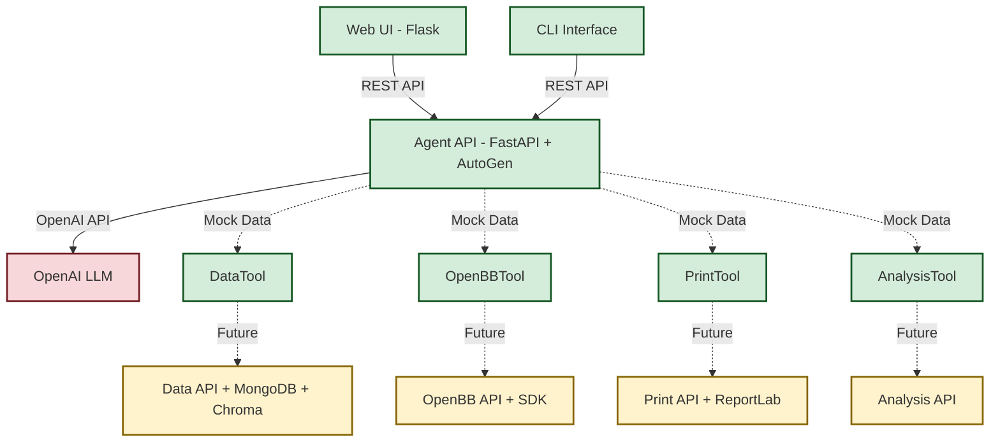

# InvestR High-Level Architecture


## Overview
A modular, containerised Docker Compose architecture comprising Python-based
microservices, each serving distinct responsibilities.


## Architecture Layout
```text
InvestR Compose (Docker Compose) - Current Implementation
│
├── Web UI (Flask) ✓ IMPLEMENTED
│   ├── Chat interface with markdown rendering
│   ├── Tool call disclosure widgets
│   └── Communicates with Agent API via REST
│
├── Agent API (FastAPI + AutoGen + OpenAI) ✓ IMPLEMENTED
│   ├── Interacts with OpenAI LLM (gpt-4o-mini)
│   ├── Executes agentic workflows using AutoGen framework
│   ├── Contains integrated tools (mock data currently):
│   │   ├── DataTool - semantic search capabilities
│   │   ├── OpenBBTool - market data retrieval
│   │   ├── PrintTool - report generation
│   │   └── AnalysisTool - financial analysis
│   └── Streaming and standard response endpoints
│
├── CLI Interface ✓ IMPLEMENTED
│   └── Command-line client for agent interaction
│
└── Future Services (Tool Integration Points):
    ├── Data API (FastAPI + MongoDB + Chroma) - PLANNED
    ├── OpenBB API (FastAPI + OpenBB) - PLANNED
    ├── Print API (FastAPI + Markdown Utils + ReportLab) - PLANNED
    └── Analysis API (FastAPI) - PLANNED
```


## Services

### Web UI (Flask) ✓ IMPLEMENTED
- **Chat Interface**: Interactive investment research chat with markdown rendering
- **Tool Call Visualization**: Disclosure widgets showing agent tool executions
- **Session Management**: User session tracking and conversation history
- **Responsive Design**: Modern, mobile-friendly interface
- **Error Handling**: Graceful error display and user feedback

### Agent API (FastAPI + AutoGen + OpenAI) ✓ IMPLEMENTED
- **AutoGen Integration**: Built on Microsoft's AutoGen framework
- **OpenAI LLM**: Uses gpt-4o-mini for natural language processing
- **Tool Orchestration**: Integrated tools for investment research workflow
- **Streaming Responses**: Real-time response streaming capabilities
- **REST Endpoints**: `/agent/query`, `/agent/stream`, `/health`
- **Type Safety**: Full Pydantic model validation

### CLI Interface ✓ IMPLEMENTED
- **Command-line Access**: Direct agent interaction without web UI
- **Session Management**: Persistent session handling
- **Development Tool**: Useful for testing and automation

### Integrated Tools (Current Mock Implementation)
These tools are implemented within the Agent API and return mock data:

#### DataTool - `search_data`
- **Purpose**: Semantic search over investment documents and data
- **Status**: Mock implementation with structured sample data
- **Future**: Will integrate with Data API (MongoDB + Chroma)

#### OpenBBTool - `get_market_data`
- **Purpose**: Real-time and historical market data retrieval
- **Status**: Mock implementation with sample market data
- **Future**: Will integrate with OpenBB API service

#### PrintTool - `generate_report`
- **Purpose**: Professional report generation in multiple formats
- **Status**: Mock implementation returning structured reports
- **Future**: Will integrate with Print API (Markdown Utils + ReportLab)

#### AnalysisTool - `analyze_data`
- **Purpose**: Statistical and financial analysis capabilities
- **Status**: Mock implementation with sample analysis results
- **Future**: Will integrate with Analysis API

### Future Microservices (Planned)
These services are designed but not yet implemented as separate containers:

#### Data API (FastAPI + MongoDB + Chroma) - PLANNED
- Embedding storage and retrieval for efficient semantic search
- User session and conversation history storage in MongoDB
- Document indexing and retrieval capabilities

#### OpenBB API (FastAPI + OpenBB) - PLANNED
- Real-time market data via OpenBB SDK
- Historical price data and financial metrics
- Company fundamental data and news feeds

#### Print API (FastAPI + Markdown Utils + ReportLab) - PLANNED
- Professional document generation from structured data
- Multiple output formats (PDF, HTML, Markdown)
- Template-based report creation

#### Analysis API (FastAPI) - PLANNED
- Advanced financial analysis and modeling
- Time-series analysis and forecasting
- Risk assessment and portfolio optimization

### Docker Compose Services Diagram



## Advantages
- **Rapid Prototyping**: Current implementation allows quick iteration and testing
- **Modularity**: Tools are designed for easy extraction into separate services
- **Type Safety**: Complete Pydantic validation throughout the system
- **Developer Experience**: CLI and web interfaces for different use cases
- **Future-Ready**: Architecture designed for microservices migration
- **Framework Integration**: Proper AutoGen implementation for agent workflows


## Project Structure & Containerization
The current implementation focuses on the core agent functionality with a clean
separation between source code and deployment:

```text
InvestRCompose/
├── README.md
├── pyproject.toml
├── uv.lock
├── LICENSE
├── docs/
│   ├── architecture.md
│   └── agent.md                   # Agent implementation details
├── investr/                       # Python package source code
|   ├── agent/                     # ✓ Agent API and AutoGen integration
|   │   ├── api.py                 # FastAPI wrapper
|   │   ├── agent.py               # Agent factory and configuration
|   │   ├── models.py              # Pydantic data models
|   │   └── tools/                 # AutoGen tool implementations
|   │       ├── data_tool.py       # Mock data search tool
|   │       ├── openbb_tool.py     # Mock market data tool
|   │       ├── print_tool.py      # Mock report generation tool
|   │       └── analysis_tool.py   # Mock analysis tool
|   ├── web/                       # ✓ Flask web application
|   │   ├── app.py                 # Web app with chat interface
|   │   └── templates/             # HTML templates
|   ├── cli/                       # ✓ Command-line interface
|   │   └── app.py                 # CLI client implementation
|   ├── common/                    # ✓ Shared schemas and utilities
|   │   └── schemas.py             # Common Pydantic models
|   ├── data/                      # 🚧 Placeholder for Data API
|   ├── openbb/                    # ✓ OpenBB API service
|   │   ├── __init__.py           # Package exports
|   │   ├── api.py                # FastAPI service endpoints
|   │   └── openbb_client.py      # OpenBB Platform integration
|   ├── print/                     # 🚧 Placeholder for Print API
|   └── analysis/                  # 🚧 Placeholder for Analysis API
├── tests/                         # ✓ Test suite (12/12 tests passing)
└── app/                           # ✓ Docker deployment configuration
    ├── compose.yml                # Current: web + agent services
    ├── .env                       # Environment configuration
    ├── .env.example               # Environment template
    └── services/                  # Service-specific Dockerfiles
        ├── web/
        │   └── Dockerfile         # ✓ Flask web service
        ├── agent/
        │   └── Dockerfile         # ✓ Agent API service
        ├── data/                  # 🚧 Future Data API service
        ├── openbb/                # ✓ OpenBB API service
        │   └── Dockerfile         # ✓ OpenBB API service
        ├── print/                 # 🚧 Future Print API service
        └── analysis/              # 🚧 Future Analysis API service
```

**Legend:**
- ✓ = Implemented and working
- 🚧 = Designed but not yet implemented

### Benefits of This Structure
- **Clean root directory**: Only essential project files at the top level
- **Deployment separation**: All containerization concerns isolated in `app/`
- **Service organization**: Each service gets dedicated folder for Docker configs
- **Monolithic-to-Microservices**: Easy transition from tools to services
- **Shared Package**: All components can import from common `investr/` package

### Build Context Strategy
- Dockerfiles use the project root as build context to access `investr/` package
- Compose files reference `../` as build context from `app/` directory
- This allows services to import from the shared `investr` Python package

### Current Docker Compose Setup
The `app/compose.yml` currently defines three services:
- **web**: Flask application (port 5000)
- **agent**: Agent API service (port 8000)
- **openbb-api**: OpenBB API service (port 8001) ✓ NEW
- **Network**: `investr-network` for service communication


## Next Steps

### Phase 1: Current State (✓ Complete)
- [x] **Core Agent Implementation**: AutoGen-based agent with tool integration
- [x] **Web Interface**: Flask chat application with markdown rendering
- [x] **CLI Interface**: Command-line access for development and testing
- [x] **Type Safety**: Complete Pydantic model coverage
- [x] **Docker Setup**: Containerized web and agent services

### Phase 2: Service Extraction (🚧 In Progress)
- [ ] **Data API Service**: Extract DataTool into standalone FastAPI service
  - MongoDB integration for session storage
  - Chroma vector database for semantic search
  - RESTful endpoints replacing mock data
- [x] **OpenBB API Service**: Extract OpenBBTool into separate service ✓
  - OpenBB SDK integration for real market data
  - FastAPI service with REST endpoints
  - Graceful fallback to mock data when service unavailable
  - Docker containerization complete

### Phase 3: Advanced Services (🔮 Planned)
- [ ] **Print API Service**: Document generation service
  - ReportLab for PDF generation
  - Markdown to HTML conversion
  - Template management system
- [ ] **Analysis API Service**: Financial analysis service
  - Time-series analysis capabilities
  - Risk assessment models
  - Portfolio optimization tools

### Phase 4: Production Readiness (🔮 Future)
- [ ] **Authentication & Security**: API key management, user authentication
- [ ] **Monitoring & Observability**: Logging, metrics, health checks
- [ ] **Performance Optimization**: Caching, connection pooling, async improvements
- [ ] **Documentation**: OpenAPI specs, integration guides, deployment docs
