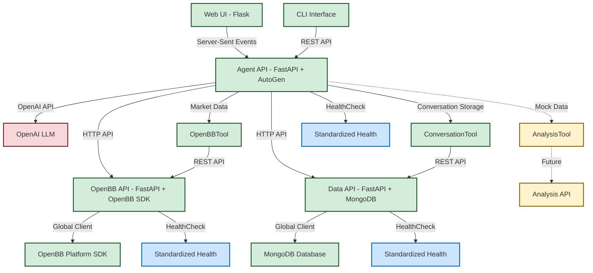

# InvestR High-Level Architecture


## Overview
A modular, containerised Docker Compose architecture comprising Python-based
microservices, each serving distinct responsibilities with standardized health
monitoring, structured tool execution tracking, and consistent client patterns.


## Architecture Layout
```text
InvestR Compose (Docker Compose) - Current Implementation
│
├── Web UI (Flask) ✓ IMPLEMENTED
│   ├── Chat interface with markdown rendering
│   ├── Tool call disclosure widgets with execution timing
│   ├── Structured ToolResult data handling
│   └── Communicates with Agent API via Server-Sent Events
│
├── Agent API (FastAPI + AutoGen + OpenAI) ✓ IMPLEMENTED
│   ├── Interacts with OpenAI LLM (gpt-4o-mini)
│   ├── Executes agentic workflows using AutoGen framework
│   ├── Automatic conversation storage with session management
│   ├── Tool execution timing and structured ToolResult tracking
│   ├── Contains HTTP client tools:
│   │   ├── ConversationTool - conversation storage and session management ✓
│   │   ├── OpenBBTool - market data retrieval via OpenBB API ✓
│   │   └── AnalysisTool - financial analysis (mock data)
│   ├── Streaming and standard response endpoints
│   └── Standardized health check with service metadata
│
├── CLI Interface ✓ IMPLEMENTED
│   └── Command-line client for agent interaction
│
├── OpenBB API (FastAPI + OpenBB Platform SDK) ✓ IMPLEMENTED
│   ├── Real-time market data via OpenBB Platform
│   ├── Historical price data with execution timing metrics
│   ├── Global singleton client pattern
│   ├── Streamlined RESTful endpoints with proper error handling
│   ├── Graceful fallback to mock data when SDK unavailable
│   └── Standardized health check with service metadata
│
├── Data API (FastAPI + MongoDB) ✓ IMPLEMENTED
│   ├── Conversation storage with MongoDB persistence
│   ├── Session-based conversation organization
│   ├── Global singleton MongoDB client pattern
│   ├── Streamlined RESTful endpoints for core operations
│   └── Standardized health check with database connectivity status
│
└── Future Services:
    └── Analysis API (FastAPI) - PLANNED
```


## Services

### Web UI (Flask) ✓ IMPLEMENTED
- **Chat Interface**: Interactive investment research chat with markdown rendering
- **Tool Call Visualization**: Enhanced disclosure widgets showing tool executions with timing data
- **Structured Data Handling**: Processes ToolResult objects with execution metrics
- **Session Management**: User session tracking and conversation history
- **Responsive Design**: Modern, mobile-friendly interface
- **Error Handling**: Graceful error display and user feedback
- **Real-time Updates**: Server-sent events for streaming agent responses

### Agent API (FastAPI + AutoGen + OpenAI) ✓ IMPLEMENTED
- **AutoGen Integration**: Built on Microsoft's AutoGen framework
- **OpenAI LLM**: Uses gpt-4o-mini for natural language processing
- **Tool Orchestration**: Integrated tools for investment research workflow
- **Streaming Responses**: Real-time response streaming with tool execution events
- **Tool Execution Tracking**: Comprehensive timing and result tracking
- **REST Endpoints**: `/agent/stream`, `/health`
- **Type Safety**: Full Pydantic model validation with ToolResult schema
- **Standardized Health**: Uses common HealthCheck schema with service metadata

### CLI Interface ✓ IMPLEMENTED
- **Command-line Access**: Direct agent interaction without web UI
- **Session Management**: Persistent session handling
- **Development Tool**: Useful for testing and automation

### OpenBB API (FastAPI + OpenBB Platform SDK) ✓ IMPLEMENTED
- **Real Market Data**: Integration with OpenBB Platform SDK v4.4.5
- **Global Singleton Client**: `openbb_client` instance for consistent access
- **Streamlined Endpoints**: `/health`, `/market-data/historical/{symbol}`
- **Execution Timing**: Built-in query performance metrics
- **LLM-Driven Parameters**: Automatically extracts symbol, period, interval from natural language
- **Error Handling**: Graceful fallback to mock data when SDK unavailable
- **Lazy Loading**: OpenBB SDK imported only when needed for container resilience
- **Type Safety**: Pydantic models with Literal types for provider validation
- **Multi-Provider Support**: yfinance, fmp, intrinio, polygon, tiingo providers
- **Standardized Health**: Uses common HealthCheck schema with service metadata

### Data API (FastAPI + MongoDB) ✓ IMPLEMENTED
- **Conversation Storage**: Persistent user-agent conversation history in MongoDB
- **Global Singleton Client**: `mongodb_client` instance for consistent database access
- **Session Management**: Session-based conversation organization for future authentication
- **Document Persistence**: Message storage with timestamps and tool call metadata
- **Streamlined Endpoints**: Core conversation operations only
- **Async Architecture**: Motor async MongoDB driver with Beanie ODM
- **Type Safety**: Complete Pydantic model validation throughout storage pipeline
- **Health Monitoring**: Database connection health checks with connectivity status
- **Single Responsibility**: Focused solely on conversation storage and retrieval
- **Standardized Health**: Uses common HealthCheck schema with database metadata

### Agent Tools (HTTP Client Implementation)
These tools are implemented within the Agent API and make HTTP calls to microservices:

#### ConversationTool - `store_conversation` ✅ IMPLEMENTED
- **Purpose**: Conversation storage and session management
- **Status**: Real MongoDB integration for persistent storage
- **Features**: Store/retrieve conversations, session tracking, message history
- **Integration**: Direct HTTP client with Data API (http://data-api:8002)
- **Fallback**: Mock storage when Data API unavailable
- **ToolResult Integration**: Structured execution tracking with timing data

#### OpenBBTool - `get_market_data` ✓ IMPLEMENTED
- **Purpose**: Real-time and historical market data retrieval
- **Status**: HTTP client calling OpenBB API service with real market data
- **Integration**: Fully functional with OpenBB Platform SDK via microservice
- **Features**: LLM parameter extraction, provider selection, error handling
- **ToolResult Integration**: Structured execution tracking with timing data

#### AnalysisTool - `analyze_data`
- **Purpose**: Statistical and financial analysis capabilities
- **Status**: Mock implementation with sample analysis results
- **Future**: Will integrate with Analysis API
- **ToolResult Integration**: Structured execution tracking prepared

### Future Microservices

#### Analysis API (FastAPI) - PLANNED
- Advanced financial analysis and modeling
- Time-series analysis and forecasting
- Risk assessment and portfolio optimization
- Will follow established patterns: global singleton client, standardized health checks, ToolResult integration

### Docker Compose Services Diagram



## Key Architectural Patterns

### Standardized Health Monitoring ✓ IMPLEMENTED
All microservices now implement standardized health checks using the common `HealthCheck` schema:

```python
class HealthCheck(BaseModel):
    service: str
    status: str
    timestamp: datetime
    version: Optional[str] = None
    metadata: Optional[Dict[str, Any]] = None
```

**Benefits:**
- Consistent health monitoring across all services
- Metadata support for service-specific status information
- Makefile targets for easy health checking (`make health`, `make agent-health`, etc.)
- Integration-ready for monitoring systems

### Global Singleton Client Pattern ✓ IMPLEMENTED
Consistent client instantiation pattern across all services:

- **OpenBB API**: `openbb_client = OpenBBClient()` - Global singleton for OpenBB Platform SDK access
- **Data API**: `mongodb_client = MongoDBClient()` - Global singleton for MongoDB connections
- **Benefits**: Consistent access patterns, reduced instantiation overhead, simplified dependency management

### Structured Tool Execution Tracking ✓ IMPLEMENTED
Enhanced tool execution with comprehensive tracking using `ToolResult` schema:

```python
class ToolResult(BaseModel):
    tool_name: str
    success: bool
    result: Union[str, Dict[str, Any], List[Any]]
    error_message: Optional[str] = None
    execution_time_ms: Optional[float] = None
```

**Features:**
- Execution timing measurement for performance monitoring
- Structured success/failure tracking
- Error message capture for debugging
- Web UI integration with disclosure widgets
- Storage in conversation history for analysis

### Service Boundary Contracts ✓ IMPLEMENTED
`investr.common.schemas` now serves as the definitive source for service boundary contracts:

- **ToolResult**: Moved from agent models to common schemas for cross-service use
- **HealthCheck**: Standardized health monitoring schema
- **UserRequest/AgentResponse**: Web UI ↔ Agent API communication
- **Benefits**: Type safety across service boundaries, consistent data structures, clear API contracts


## Advantages
- **Rapid Prototyping**: Current implementation allows quick iteration and testing
- **Modularity**: Tools are designed for easy extraction into separate services
- **Type Safety**: Complete Pydantic validation throughout the system
- **Developer Experience**: CLI and web interfaces for different use cases
- **Future-Ready**: Architecture designed for microservices migration
- **Framework Integration**: Proper AutoGen implementation for agent workflows
- **Standardized Patterns**: Consistent health monitoring, client patterns, and tool execution tracking
- **Performance Monitoring**: Built-in execution timing and metrics collection
- **Maintainability**: Clear service boundaries and consistent architectural patterns


## Project Structure & Containerization
The current implementation focuses on the core agent functionality with a clean
separation between source code and deployment, following consistent naming patterns:

```text
InvestRCompose/
├── README.md
├── pyproject.toml
├── uv.lock
├── LICENSE
├── Makefile                         # ✓ Enhanced with health monitoring targets
├── docs/
│   ├── architecture.md
│   └── agent.md                     # Agent implementation details
├── investr/                         # Python package source code
|   ├── agent/                       # ✓ Agent API and AutoGen integration
|   │   ├── api.py                   # FastAPI wrapper with ToolResult tracking
|   │   ├── agent.py                 # Agent factory and configuration
|   │   ├── models.py                # Pydantic data models
|   │   └── tools/                   # AutoGen tool implementations
|   │       ├── conversation_tool.py # Conversation storage tool ✓
|   │       ├── openbb_tool.py       # Market data tool via OpenBB API ✓
|   │       └── analysis_tool.py     # Mock analysis tool
|   ├── web/                         # ✓ Flask web application
|   │   ├── app.py                   # Web app with enhanced tool result display
|   │   ├── static/js/app.js         # ✓ Enhanced with ToolResult handling
|   │   └── templates/               # HTML templates
|   ├── cli/                         # ✓ Command-line interface
|   │   └── app.py                   # CLI client implementation
|   ├── common/                      # ✓ Shared schemas and utilities
|   │   └── schemas.py               # ✓ Service boundary contracts (HealthCheck, ToolResult)
|   ├── data/                        # ✓ Data API service (conversation storage)
|   │   ├── __init__.py              # Package exports
|   │   ├── api.py                   # ✓ Streamlined FastAPI endpoints
|   │   ├── models.py                # Beanie ODM models for MongoDB
|   │   └── client.py                # ✓ Global MongoDB client (renamed from database.py)
|   ├── openbb/                      # ✓ OpenBB API service
|   │   ├── __init__.py              # Package exports with global client
|   │   ├── api.py                   # ✓ Streamlined FastAPI service endpoints
|   │   └── client.py                # ✓ Global OpenBB client (renamed from openbb_client.py)
|   └── analysis/                    # 🚧 Placeholder for Analysis API
├── tests/                           # ✓ Test suite
└── app/                             # ✓ Docker deployment configuration
    ├── compose.yml                  # Current: web + agent + data + openbb services
    ├── .env                         # Environment configuration
    ├── .env.example                 # Environment template
    └── services/                    # Service-specific Dockerfiles
        ├── web/                     # ✓ Flask web service
        │   └── Dockerfile
        ├── agent/                   # ✓ Agent API service
        │   └── Dockerfile
        ├── data/                    # ✓ Data API service
        │   └── Dockerfile
        ├── openbb/                  # ✓ OpenBB API service
        │   └── Dockerfile
        └── analysis/                # 🚧 Future Analysis API service
```

**Legend:**
- ✓ = Implemented and working
- 🚧 = Designed but not yet implemented

### Benefits of This Structure
- **Clean root directory**: Only essential project files at the top level
- **Deployment separation**: All containerization concerns isolated in `app/`
- **Service organization**: Each service gets dedicated folder for Docker configs
- **Monolithic-to-Microservices**: Easy transition from tools to services
- **Shared Package**: All components can import from common `investr/` package
- **Consistent Naming**: Standardized `client.py` naming across all services
- **Service Boundaries**: Clear separation between internal models and service contracts

### Build Context Strategy
- Dockerfiles use the project root as build context to access `investr/` package
- Compose files reference `../` as build context from `app/` directory
- This allows services to import from the shared `investr` Python package

### Current Docker Compose Setup
The `app/compose.yml` currently defines five services:
- **web**: Flask application (port 5000) with enhanced tool result display
- **agent**: Agent API service (port 8000) with structured tool execution tracking
- **data-api**: Data API service with conversation storage (port 8002) ✓ IMPLEMENTED
- **openbb-api**: OpenBB API service (port 8001) ✓ IMPLEMENTED
- **mongodb**: MongoDB database for conversation persistence (port 27017) ✓ IMPLEMENTED
- **Network**: `investr-network` for service communication

**Service Dependencies:**
- Web UI → Agent API (Server-sent events for real-time updates)
- Agent API → Data API (conversation storage with tool execution metadata)
- Agent API → OpenBB API (market data with execution timing)
- Data API → MongoDB (document persistence with global client)
- All services communicate via `investr-network` bridge network
- All services expose standardized health checks at `/health`


## Development Workflow

### Health Monitoring ✓ IMPLEMENTED
Comprehensive health checking with Makefile targets:

```bash
make health          # Check all services
make agent-health    # Check Agent API
make data-health     # Check Data API  
make openbb-health   # Check OpenBB API
make webui-health    # Check Web UI
```

All services return standardized health responses with service-specific metadata.

### Service Architecture Patterns ✓ IMPLEMENTED
**Established Patterns for Future Services:**
1. **Global Singleton Clients**: `service_client = ServiceClient()` pattern
2. **Standardized Health Checks**: Common HealthCheck schema with metadata
3. **Service Boundary Contracts**: Shared schemas in `investr.common.schemas`
4. **ToolResult Integration**: Structured execution tracking for all tools
5. **Consistent File Naming**: `client.py` for all service clients
6. **Streamlined Endpoints**: Focus on core functionality, remove unused endpoints


## Next Steps

### Phase 1: Current State (✓ Complete)
- [x] **Core Agent Implementation**: AutoGen-based agent with tool integration
- [x] **Web Interface**: Flask chat application with markdown rendering
- [x] **CLI Interface**: Command-line access for development and testing
- [x] **Type Safety**: Complete Pydantic model coverage
- [x] **Docker Setup**: Containerized web and agent services

### Phase 2: Conversation Storage (✓ Complete)
- [x] **Data API Service**: Standalone FastAPI service with conversation storage
- [x] **MongoDB Integration**: Async document storage with Beanie ODM
- [x] **Session Management**: Session-based conversation organization
- [x] **Agent Integration**: Automatic conversation capture in agent workflows
- [x] **Tool Call Metadata**: Capture and store tool execution details
- [x] **RESTful Endpoints**: Full CRUD operations for conversation management
- [x] **Docker Orchestration**: Multi-service Docker Compose with persistent volumes
- [x] **Type Safety**: Complete Pydantic validation throughout storage pipeline

### Phase 3: Service Extraction (✓ Complete)
- [x] **OpenBB API Service**: Extract OpenBBTool into separate service ✓ COMPLETE
  - OpenBB Platform SDK v4.4.5 integration for real market data
  - FastAPI service with REST endpoints (/health, /market-data/*)
  - LLM-driven parameter extraction (symbol, period, interval, provider)
  - Graceful fallback to mock data when SDK unavailable
  - Docker containerization with multi-stage builds
  - HTTP client integration in agent tools
  - Type safety with Pydantic models and Literal types

### Phase 4: Architecture Simplification (✓ Complete)
- [x] **Remove Semantic Search**: Simplify architecture by removing document search ✓ COMPLETE
  - Removed Search API microservice and Azure AI Search integration
  - Deleted SearchTool and DataTool from agent tools
  - Removed ETF document processing and indexing capabilities
  - Cleaned up Azure AI Search and PDF processing dependencies
  - Simplified Docker Compose to core services only
  - Focused architecture on core investment research using OpenBB market data

### Phase 5: Architecture Standardization (✓ Complete)
- [x] **HealthCheck Schema Standardization**: Common health monitoring across all services ✓ COMPLETE
- [x] **ToolResult Schema Migration**: Moved to service boundary contracts for cross-service use ✓ COMPLETE  
- [x] **Client Pattern Standardization**: Global singleton pattern for consistent service access ✓ COMPLETE
- [x] **File Naming Consistency**: Standardized `client.py` naming across services ✓ COMPLETE
- [x] **Endpoint Streamlining**: Removed unused endpoints, focused on core functionality ✓ COMPLETE
- [x] **Makefile Health Targets**: Comprehensive health monitoring commands ✓ COMPLETE
- [x] **Web UI Enhancement**: Structured ToolResult handling with execution timing display ✓ COMPLETE

### Phase 6: Advanced Services (🔮 Planned)
- [ ] **Analysis API Service**: Financial analysis service following established patterns
  - Time-series analysis capabilities
  - Risk assessment models
  - Portfolio optimization tools
  - Will implement: global singleton client, standardized health checks, ToolResult integration

### Phase 7: Production Readiness (🔮 Future)
- [ ] **Authentication & Security**: User authentication, session-based auth integration
- [ ] **Monitoring & Observability**: Logging, metrics, comprehensive health checks, alerting
- [ ] **Performance Optimization**: Caching, connection pooling, async improvements
- [ ] **Documentation**: OpenAPI specs, integration guides, deployment docs
- [ ] **Testing**: Comprehensive test coverage for all services and patterns
- [ ] **CI/CD**: Automated testing, building, and deployment pipelines
