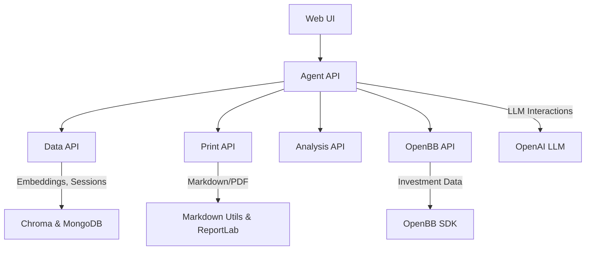

# InvestR High-Level Architecture


## Overview
A modular, containerised Docker Compose architecture comprising Python-based
microservices, each serving distinct responsibilities.


## Architecture Layout
```text
InvestR Compose (Docker Compose)
│
├── Web UI (Flask)
│   └── Presents UI; interacts with Agent API.
│
├── Agent API (FastAPI + AutoGen2 + OpenAI)
│   ├── Interacts with LLM (OpenAI).
│   ├── Execute agentic workflow and tool calls.
│   └── Calls out to modular tool services:
│       ├── Data API (FastAPI + MongoDB + Chroma)
│       ├── Print API (FastAPI + Markdown Utils + ReportLab)
│       ├── Analysis API (placeholder; FastAPI)
│       └── OpenBB API (FastAPI + OpenBB)
│
├── Data API (FastAPI + MongoDB + Chroma)
│   ├── Stores and retrieves embeddings in Chroma.
│   └── Stores user sessions and conversations in MongoDB.
│
├── OpenBB API (FastAPI + OpenBB)
│   └── Provides investment data via OpenBB SDK.
│
├── Print API (FastAPI + Markdown Utils + ReportLab)
│   └── Generates Markdown and PDF documents.
│
└── Analysis API (placeholder; FastAPI)
    └── Placeholder endpoints for future time-series models.
```


## Services

### Web UI (Flask)
- Handles user interactions and UI.
- Communicates with the Agent API.

### Agent API (FastAPI + AutoGen2 + OpenAI)
- Central orchestrator for agent workflows.
- Interacts with OpenAI LLM for natural language processing.
- Manages calls to financial APIs and downstream services.

### Data API
- Embedding storage and retrieval for efficient semantic search.
- Stores user sessions and conversation history in MongoDB.

### OpenBB API
- Provides access to investment data via OpenBB SDK.

### Print API (FastAPI + Markdown Utils + ReportLab)
- Dedicated service for creating documents from structured inputs using Markdown
  Utils or ReportLab.

### Analysis API (Placeholder)
- Future-oriented service reserved for time-series analysis.

### Docker Compose Services Diagram



## Advantages
- **Modularity:** Clearly defined, replaceable services.
- **Scalability:** Each service independently scalable.
- **Maintainability:** Simple service boundaries ease debugging.
- **Flexibility:** Easy experimentation and service swaps.


## Project Structure & Containerization
To maintain a clean project root and organize containerization concerns, all
Docker-related files are located in the `app/` directory:
```text
InvestRCompose/
├── README.md
├── pyproject.toml
├── uv.lock
├── LICENSE
├── docs/
│   └── architecture.md
├── investr/                    # Python package source code
|   ├── agent/                  # Agent API and models
|   ├── common/                 # Common schemas and utilities
|   ├── data/                   # Data API and utilities
|   ├── openbb/                 # OpenBB API integration
|   ├── print/                  # Print API utilities
|   └── analysis/               # Analysis API (placeholder)
├── tests/                      # Test suite
└── app/                        # All deployment/containerization
    ├── compose.yml             # Main Docker Compose file
    ├── .env                    # Environment variables
    ├── .env.example            # Environment template
    └── services/               # Service-specific Dockerfiles
        ├── web/
        │   └── Dockerfile
        ├── agent/
        │   └── Dockerfile
        ├── data/
        │   └── Dockerfile
        ├── openbb/
        │   └── Dockerfile
        ├── print/
        │   └── Dockerfile
        └── analysis/
            └── Dockerfile
```

### Benefits of This Structure
- **Clean root directory:** Only essential project files at the top level
- **Deployment separation:** All containerization concerns isolated in `app/`
- **Service organization:** Each service gets dedicated folder for Docker configs

### Build Context Strategy
- Dockerfiles use the project root as build context to access `investr/` package
- Compose files reference `../` as build context from `app/` directory
- This allows services to import from the shared `investr` Python package


## Next Steps
- Define REST API contracts and data schemas (e.g., Pydantic).
- Implement placeholder services with dummy endpoints.
- Document data flows and interaction patterns clearly.
